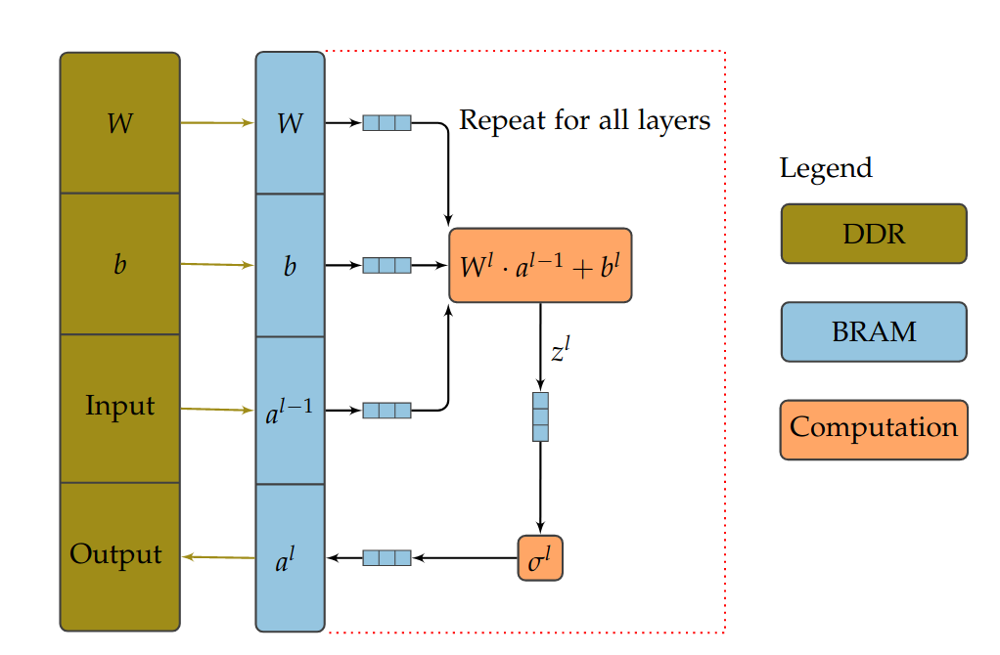
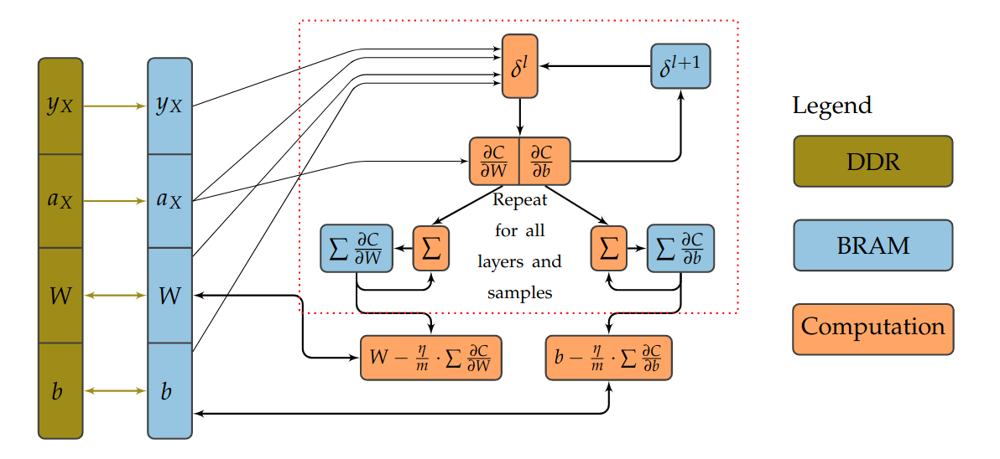
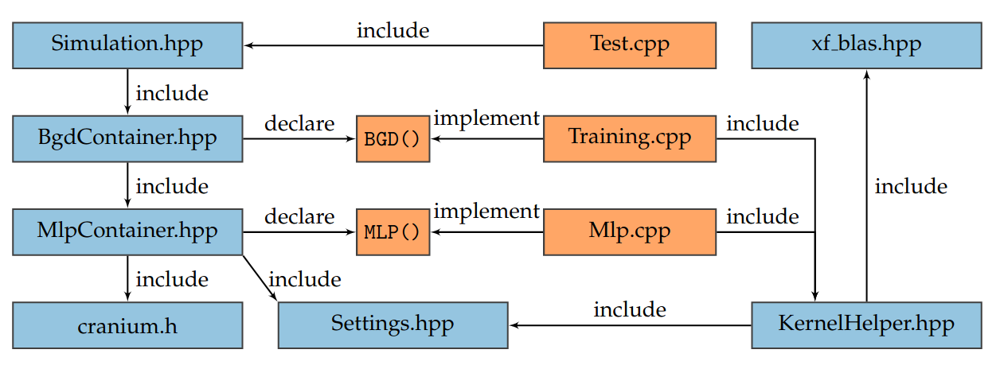

# Vitis HLS implementation of a MLP with BGD

This repository contains the implementation of a simple artificial neural network, the multilayer perceptron, with the corresponding batch gradient descent (BGD) training algorithm. It is a High Level Synthesis (HLS) implementation using Xilinx Vitis HLS and the Vitis Libraries. The implementation functionally behaves like the reference implementation [Cranium](https://github.com/100/Cranium) but it can be executed on a Xilinx FPGA. The kernels are implemented in a dataflow architecure which is illustrated by the figures below. This project is a contribution to the [UltraZohm](https://ultrazohm.com/) project and licensed under the Apache 2.0 license.

Block diagram of the HLS implementation of the MLP. The algorithm is split up in the matrix vector processing and the application of $\sigma^l$ to $z^l$ . The compute units are connected with streams. The red boundary describes the function ``processLayer()`` which computes the output of one layer.

Block diagram of the HLS implementation of the BGD. The algorithm works on a batch $X$ of multiple samples which are given by the MLP. The sequence in the red boundary is executed for every sample in the batch.

# Project Structure

The directories in the repository contain the following files:

include

- ``KernelHelper.hpp``: Custom dataflow functions to implement the kernels in the directory kernel
- ``MlpContainer.hpp``: Forward declaration of the top level Vitis kernel function ``MLP()`` and the simulation wrapper class ``MlpContainer``. This class offers utilities to simulate the MLP kernel.
- ``BgdContainer.hpp``: Forward declaration of the top level Vitis kernel function ``BGD()`` and the simulation wrapper class ``BgdContainer``. This class offers utilities to simulate the BGD kernel.
- ``Settings.hpp``: Synthesis time adjustments to the kernel and simulation settings.
- ``Simulation.hpp``: Simply includes the files ``MlpContainer.hpp``, ``BgdContainer.hpp`` and ``Simulation.hpp`` as an include wrapper for the main test bench.

kernel

- ``Mlp.cpp``: HLS implementation of the MLP kernel.
- ``Training.cpp``: HLS implementation of the BGD kernel.

test

- ``Test.cpp``: Test bench for MLP and BGD kernel.

Vitis_Libraries:

- Vitis Libraries providing basic linear algebra subprogramms (BLAS) included as a git submodule

Cranium:

- C implementatino of the MLP and the BGD, which is used as a reference implementation in the C testbench

The figure below illustrates the include structure of the project:

